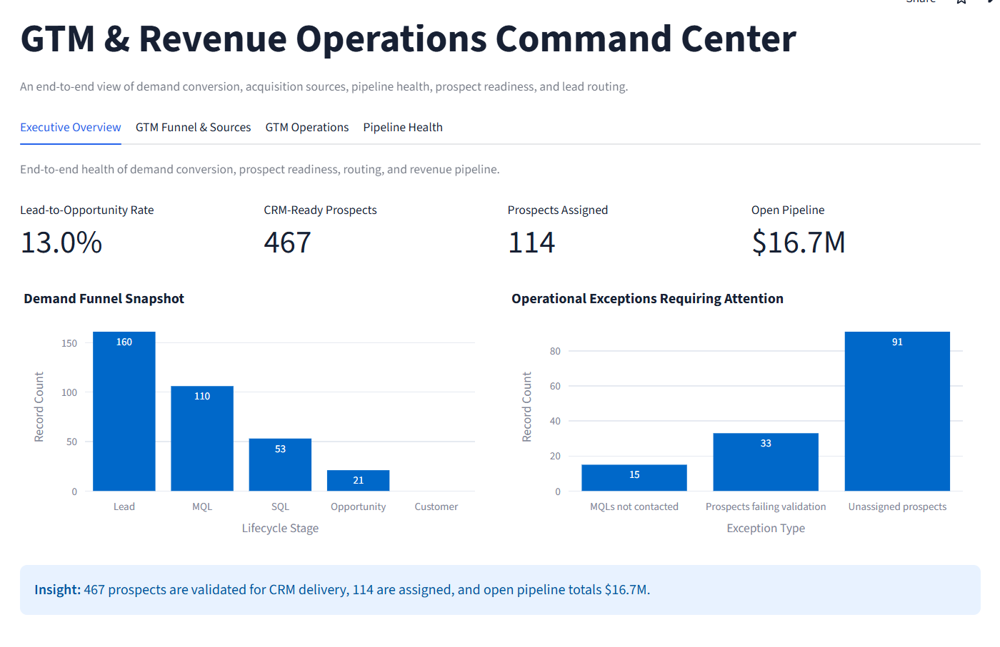
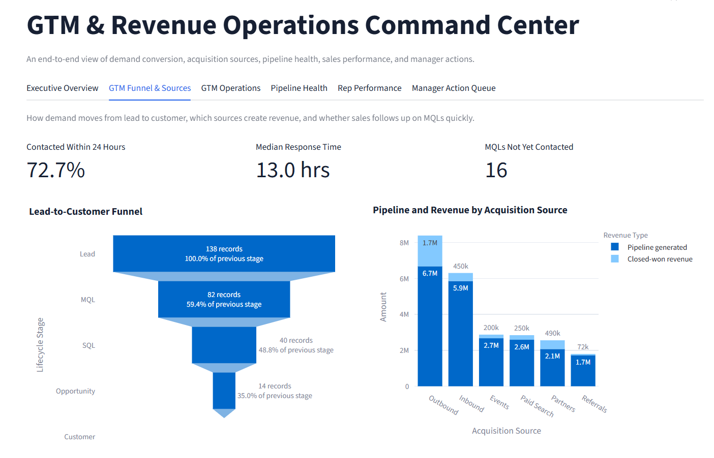
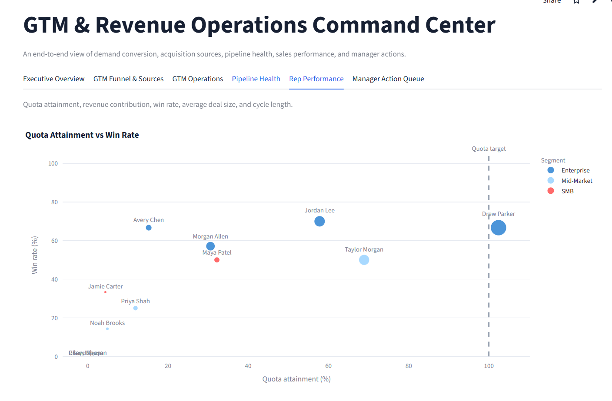

# GTM & Revenue Operations Command Center

An interactive portfolio project that models an end-to-end go-to-market and revenue operations workflow using synthetic CRM, prospect, routing, pipeline, and outbound-event data.

The dashboard connects demand generation to revenue execution: leads enter the funnel, prospect records are enriched and validated, approved prospects are scored and routed, outbound performance is measured, and pipeline risk is translated into manager actions.

**[Open the Live Dashboard](https://gtm-revops-command-center.streamlit.app/)**

## Dashboard Preview

### Executive Overview



### GTM Funnel & Sources



### Rep Performance



The displayed values are synthetic. In the example snapshot, the dashboard identifies a 10.1% lead-to-opportunity rate, 467 CRM-ready prospects, 98 assigned prospects, $15.9M in open pipeline, and $5.4M in high-risk pipeline.

## Business Questions Addressed

- How efficiently does demand convert from lead to customer?
- Which acquisition sources generate pipeline and closed-won revenue?
- Is sales contacting marketing-qualified leads within the response SLA?
- Which prospect records are valid, current, unique, and ready for CRM delivery?
- Which prospects meet the scoring and human-review criteria for routing?
- Which representatives are eligible and accepting new leads?
- Which outbound messages perform best by segment?
- Where is open pipeline concentrated, aging, or at risk?
- Which representatives are attaining quota?
- Which opportunities require manager action before the next forecast review?

## End-to-End Operating Model

The command center covers the full path from demand creation to revenue execution and manager follow-through:

1. **Demand Generation & Funnel Performance** — track leads through MQL, SQL, opportunity, and customer stages; compare conversion rates and acquisition-source contribution.
2. **Marketing-to-Sales Handoff** — monitor whether MQLs receive a first sales contact within the response SLA and identify leads still awaiting contact.
3. **Prospecting & Enrichment** — standardize company and contact data, validate emails and domains, assess provider quality and freshness, and exclude duplicate records.
4. **Scoring & Human Review** — calculate fit, intent, signal-quality, and data-confidence scores, then approve, reject, or hold each prospect with a reason code.
5. **Lead Routing** — route only approved prospects using territory, segment, rep availability, remaining capacity, and round-robin assignment. Rejected, pending, and held prospects do not enter this stage.
6. **Outbound Strategy & Experiments** — assign message variants deterministically and compare delivery, replies, positive replies, meetings, sample sizes, and confidence intervals.
7. **Pipeline & Forecast Management** — monitor expected pipeline value, stage aging, forecast categories, past-due Commit deals, and rules-based Deal Risk Level.
8. **Rep Performance Management** — compare quota attainment, win rate, closed-won revenue, average deal size, and sales-cycle length.
9. **Manager Action & Feedback** — prioritize medium- and high-risk opportunities, assign blocker-specific next steps, and feed outcomes back into scoring, routing, and forecast reviews.

The **Executive Overview** summarizes the health of this complete operating model across demand conversion, CRM readiness, assignment, pipeline, and risk.

## Key Features

- End-to-end executive overview spanning demand conversion, CRM readiness, routing, pipeline, and deal risk
- Lead-to-customer funnel based on dated lifecycle milestones
- Pipeline and closed-won revenue by acquisition source
- Marketing-to-sales response SLA summary
- Provider-quality comparison using validity, duplicate rate, freshness, and source confidence
- Validated and enriched prospect records ready for CRM delivery
- Configurable fit, intent, signal-quality, and data-confidence scoring
- Human approve, reject, and hold review gate with reason codes
- Approved-only routing using territory, segment, rep availability, capacity, and round-robin rules
- Outbound experiment reporting with 95% Wilson confidence intervals and allocation recommendations
- Expected pipeline value and deal risk by sales stage
- Rep performance by quota attainment, win rate, revenue, deal size, and sales-cycle length
- Prioritized manager action queue for medium- and high-risk opportunities
- Synthetic data generator for safe public demonstration

## Dashboard Sections

- **Executive Overview:** End-to-end health of demand conversion, prospect readiness, routing, revenue pipeline, and risk.
- **GTM Funnel & Sources:** Funnel conversion, acquisition-source performance, and marketing-to-sales response time.
- **GTM Operations:** Enrichment, scoring and review, approved-only routing, and outbound experimentation.
- **Pipeline Health:** Expected pipeline value, stage aging, forecast categories, and deal-risk distribution.
- **Rep Performance:** Quota attainment, win rate, revenue contribution, average deal size, and sales-cycle length.
- **Manager Action Queue:** Opportunities prioritized for validation, escalation, or a dated next step.

## Scoring Method

Prospect scores are transparent and configurable:

- **Fit:** segment, company size, and role
- **Intent:** website visits, content engagement, and pricing-page views in the last 30 days
- **Signal quality:** signal recency, corroboration, and source confidence
- **Data confidence:** email validity, domain validity, and record freshness

The component weights are normalized to 100%. A human review gate remains between scoring and routing so the score informs a decision rather than automatically activating every prospect.

## Routing Criteria

Approved prospects are evaluated in this order:

1. Valid email and domain
2. No duplicate record
3. Territory match
4. Segment match
5. Representative accepting new leads
6. Remaining representative capacity
7. Round-robin assignment among eligible representatives

## Deal Risk Method

Deal Risk Level is a deterministic, auditable rating based on:

- Deal notes and identified blockers
- Sales stage
- Days in the current stage
- Recent activity
- Expected close date
- Forecast category

The rules produce a Low, Medium, or High rating, a concise risk reason, and a blocker-specific manager action. This is a rules-based operations model, not a predictive machine-learning model.

## Tech Stack

- Python
- Streamlit
- pandas
- Plotly

## Project Structure

```text
sales-ops-command-center/
  app.py
  requirements.txt
  README.md
  assets/
    executive-overview.png
    gtm-funnel-sources.png
    rep-performance.png
  data/
    synthetic_deals.csv
    synthetic_leads.csv
    synthetic_prospects.csv
    rep_capacity.csv
    outbound_events.csv
    rep_quotas.csv
  src/
    generate_data.py
    gtm_operations.py
    metrics.py
    risk_scoring.py
```

## Run Locally

Install dependencies:

```bash
pip install -r requirements.txt
```

Run the app:

```bash
streamlit run app.py
```

The first run generates synthetic input data when local CSV files are not present.

## Synthetic Data Disclaimer

All CRM, prospect, representative, and outbound-event data is synthetic. No real customer, employer, prospect, or CRM export data is used.

## Production Extensions

With access to production systems, the next steps would be to:

- Connect Salesforce or HubSpot opportunities, accounts, contacts, owners, and activity history
- Integrate enrichment, email-validation, and outbound-sequencing providers
- Persist review decisions and routing history in an operational database
- Validate lifecycle stages, forecast categories, quotas, territories, and SLA definitions with business owners
- Reconcile closed-won revenue against finance-approved bookings
- Track stage movement and forecast changes over time
- Add role-based access, audit logs, alerts, and scheduled manager summaries
